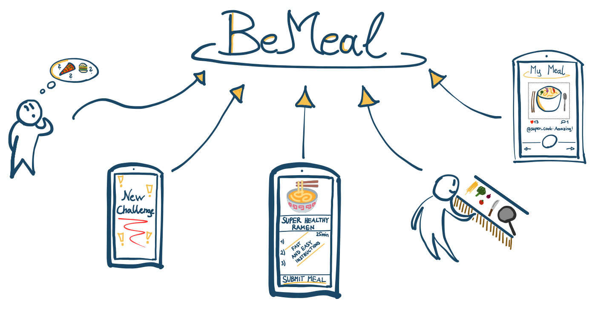
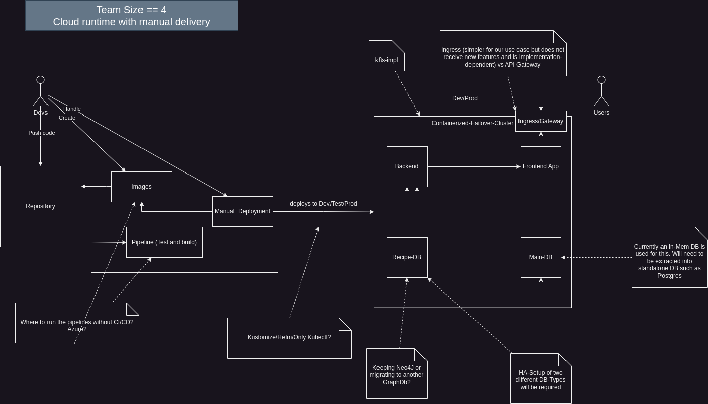

# BeMeal
[Value Proposition](https://docs.google.com/document/d/1yCiTlyCzs5Xh76Sr9qxPXsAMTYLudvXjx2vBnH-TDuQ/edit?usp=sharing)

## TL;DR
BeMeal is a web app where users join leagues to participate in cooking challenges. Challenges involve preparing specified meals and completing them by providing photo proof to the community. Users compete for points and digital collectibles, fostering a social cooking community with gamified elements, initially targeting Austria.

## Userexperience Sketch

## Functional Design

Given
- Spring Boot Backend
- Angular Frontend
- In-Memory-DB (H2)
- Graph DB (Neo4j)

### Two development variants

## Roadmap / Bigger Tasks

WIP: Plan how your team will achieve this until the final presentation (very roughly)

Some of these tasks could be done in parallel or modified so that they are doable separately 

- Setup k8s cluster with whole app in single image (or with simple hello world)
- Pack 4 main blocks (2x DB, Back-/Frontend into images)
  - Requires migration from H2-DB to something standalone being done before
- Manual deployment of fully containerized app to k8s

> End of first "diagram" = Cloud runtime with manual delivery
--- 

- Eliminating manual deployment steps:
  - Automating Image Generation (and storage?)
  - Automating K8s Deployment

---

- Possibly adding new features?
  - Extracting and expanding statistics page?
  - Using user statistics for auto-scaling

## Costs
The planned maximal budget for the realization of this project is 100€.
